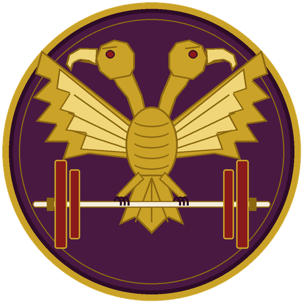
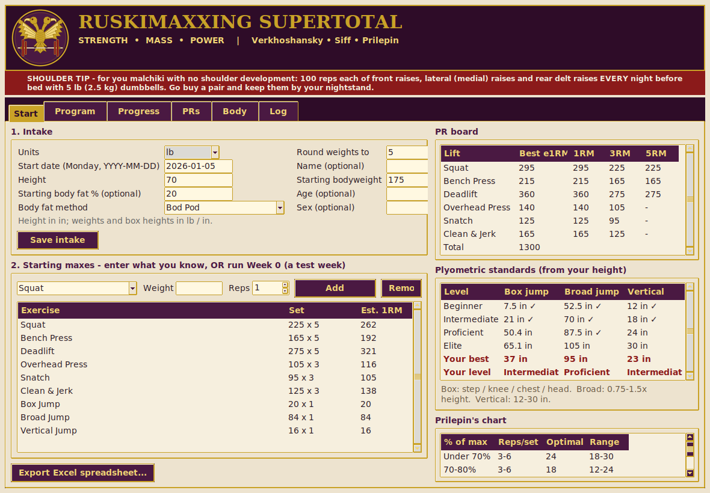
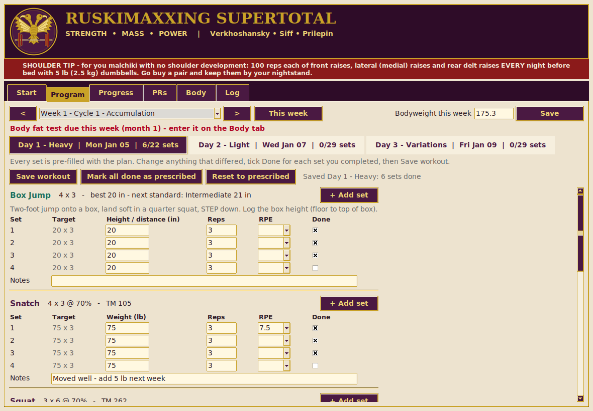
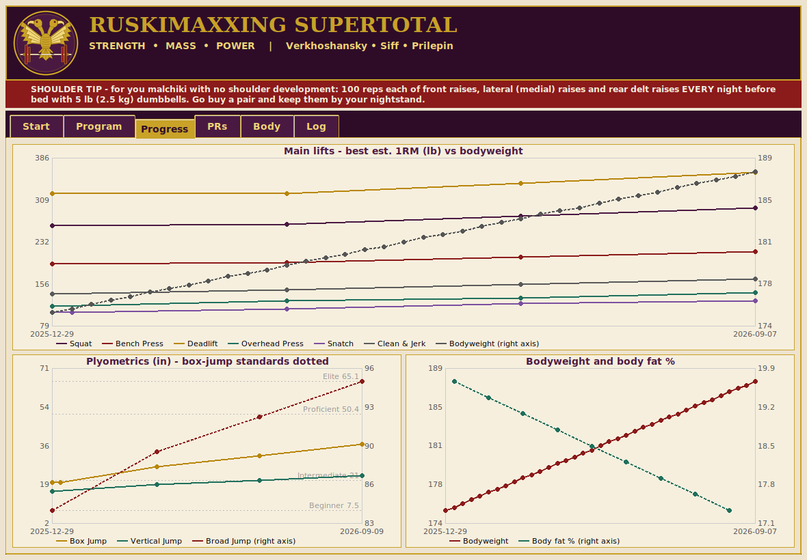

<p align="center"></p>

# ruskimaxxingsupertotal

**A free 1-year supertotal program: squat, bench press, deadlift, overhead press, snatch and clean & jerk,
with PR tracking for every lift.**

This is the brother project of [**ruskimaxxing**](https://github.com/andrewsdillon-design/ruskimaxxing).
It's the same conjugate / undulating system built on Verkhoshansky, Siff and Prilepin, with plyometrics,
plus the two Olympic lifts and their variations. Prilepin built his chart from weightlifters,
so the Olympic lifts follow it too. This is well-established training knowledge, and it should be free for everyone.

| | |
|---|---|
|  |  |
| **Start**: intake, PR board, jump standards, Prilepin's chart | **Program**: every set pre-filled; change what differed, tick Done |
|  | |
| **Progress**: lifts vs bodyweight, jumps vs standards, body fat | |

| Format | Get it |
|---|---|
| Excel spreadsheet | [`spreadsheet/RuskiMaxxingSupertotal.xlsx`](spreadsheet/RuskiMaxxingSupertotal.xlsx) |
| Windows app | `RuskiMaxxingSupertotal-Windows.exe` on the [Releases](../../releases) page |
| macOS app | `RuskiMaxxingSupertotal-macOS.zip` on the [Releases](../../releases) page |
| Linux app | `RuskiMaxxingSupertotal-Linux.tar.gz` on the [Releases](../../releases) page |
| iPhone / Android | Planned if there's interest |

## Requirements

### Using the program (no programming needed)

| You're using | What you need | Notes |
|---|---|---|
| **Excel spreadsheet** | Excel 2019, Excel 2021 or Microsoft 365 (Windows or Mac), **or** LibreOffice 5.2+, **or** Google Sheets | Excel 2016 and older **won't work**: they lack the `MAXIFS` function the PR tracking uses. |
| **Windows app** | Windows 10 or 11 (64-bit) | Nothing else to install. It's unsigned, so SmartScreen may warn: click *More info → Run anyway*. |
| **macOS app** | macOS on Apple Silicon (M1 or newer) | Nothing else to install. It's unsigned: the first time, right-click the app → *Open*. On an Intel Mac, run it from source (below). |
| **Linux app** | 64-bit Linux with a desktop (built on Ubuntu 24.04; similar or newer distros) | Nothing else to install. Unpack with `tar -xzf RuskiMaxxingSupertotal-Linux.tar.gz`, then run `./RuskiMaxxingSupertotal`. |

### Running from source (any OS)

| Requirement | Windows | macOS | Linux |
|---|---|---|---|
| Python 3.10+ | [python.org](https://www.python.org/downloads/) installer | [python.org](https://www.python.org/downloads/) installer or `brew install python` | Usually preinstalled |
| tkinter (for the desktop app) | Included with the python.org installer | Included with python.org; with Homebrew: `brew install python-tk` | Debian/Ubuntu: `sudo apt install python3-tk`<br>Fedora: `sudo dnf install python3-tkinter`<br>Arch: `sudo pacman -S tk` |
| openpyxl + Pillow (Excel export, logo) | `pip install -r requirements.txt` | same | same |

Python packages are listed in [`requirements.txt`](requirements.txt) (for using the program) and
[`requirements-dev.txt`](requirements-dev.txt) (for tests and building the apps).

**Optional, for developers only:** LibreOffice (`soffice`) lets the spreadsheet test recalculate every
formula, and Xvfb (`xvfb-run`, Linux) runs the desktop-app test without a screen. Both tests skip
automatically if these aren't installed.

## Getting started

1. **Intake** (Start Here tab in the app / sheet in Excel): units, plate rounding, your start Monday,
   **height** (sets your box jump standards), bodyweight, and optionally body fat, age and sex.
2. **Starting maxes**, either way works:
   - **Enter what you know.** Any movement or variation, the weight and the reps (1 for a true max, or e.g. 185 × 5).
   - **Test.** Run **Week 0**, an optional test week, and log what you hit.

   Variations you haven't done yet are estimated from the main lift until you log them.
3. Train 3 days a week (e.g. Mon / Wed / Fri). **Every set** is pre-filled with the plan's weight and reps:
   change anything that was different, add RPE if you like, tick **Done**, and save.
   Only completed sets count toward PRs and maxes.

> **SHOULDER TIP**: for you malchiki with no shoulder development, do 100 reps each of front raises,
> lateral (medial) raises and rear delt raises **every night before bed** with 5 lb (2.5 kg) dumbbells.
> Go buy a pair and keep them by your nightstand.

## The year

| Weeks | What happens |
|---|---|
| 0 | Optional baseline test week |
| 1-12, 13-24, 25-36, 37-48 | Four 12-week cycles (below) |
| **12, 24, 36, 48** | **Test weeks**: new maxes on all six lifts (your supertotal), the block's variations, and your jumps |
| 49-51 | Transition: lighter volume work |
| 52 | Full deload before the next year |

### Each 12-week cycle

| Cycle week | Phase | Main-lift intensity |
|---|---|---|
| 1-3 | Accumulation: build muscle and work capacity | 60-75% |
| 4 | **Deload** | 60% |
| 5-7 | Transmutation: turn muscle into strength | 65-82.5% |
| 8 | **Deload** | 65% |
| 9-10 | Realization: heavy, low-rep strength | 67.5-90% |
| 11 | **Taper**: volume cut ~50%, intensity kept, so you arrive at the test fresh | 65-80% |
| 12 | **Test** | new maxes |

Every percentage is of that exercise's **own training max**: the best estimated 1RM logged before the
cycle started. So each cycle automatically builds on the last test.

### Each week

| Day | Plyometrics | Main lifts | Accessories |
|---|---|---|---|
| 1 - Heavy | Box jump | **Snatch** (heavy), Squat (heavy), Bench (heavy) | Row, face pull |
| 2 - Light | Broad jump, med ball chest pass | **Clean & jerk** (heavy), Squat (light), Overhead press (medium), Deadlift (medium) | Chin-up, plank |
| 3 - Variations | Rotating: depth jump, hurdle hop, vertical jump, lateral bound, plyo push-up, seated box jump | Rotating **Olympic variation** (power snatch, power clean, hang snatch, hang clean, snatch balance, push jerk, block snatch, split jerk) + squat / bench / deadlift variations | Incline DB press, pushdown |

Olympic lifts come first in the session, while you're fresh. They use low reps (1-3 per set) and the low end
of Prilepin's total-rep range, so technique stays crisp. Every Olympic variation gets its own PR record;
until you log one, its max is estimated from your snatch or clean & jerk.

Day 3 variations rotate every 3-week block (conjugate style), so over the year you build and test
PRs on many variations.

### Plyometric standards (worked out from your height)

Box, broad and vertical jumps are tested in week 0 and every test week (box on Day 1, broad on Day 2,
vertical on Day 3). Your best and your level are shown on the front page and in the app.

| Level | Box jump | Broad jump | Vertical jump |
|---|---|---|---|
| Beginner | 1 step (7.5 in / 19 cm) | 3/4 of your height | 12 in / 30 cm |
| Intermediate | Above knee height (~30% of height) | Your height | 18 in / 46 cm |
| Proficient | Chest height (~72% of height) | 1.25 × your height | 24 in / 61 cm |
| Elite | Head height (~93% of height) | 1.5 × your height | 30 in / 76 cm |

Broad and vertical numbers are common rules of thumb. Every other plyo (depth jump, hurdle hop,
lateral bound, plyo push-up, seated box jump, med ball chest pass) is logged by height or distance
and tracked as its own PR. The front page and the app explain how to do and measure each one.

## PR tracking

- **Every movement and every variation** gets its own record: snatch, power snatch, hang snatch, clean & jerk,
  power clean, push jerk, squat, box squat, pause squat, bench,
  1-board, 2-board, 3-board, floor press, deficit deadlift, block pull, and so on, plus accessories and jumps.
- For each one you get the **best estimated 1RM** and **rep maxes for 1, 2, 3, 4, 5, 6, 8, 10 and 12 reps**
  (a rep max is the heaviest weight lifted for *at least* that many reps).
- The app pops up **"New PR!"** when you log one. The spreadsheet flags PRs in red.
- **Box jump**: your best height is tracked and shown against your standard.

## Body tracking and charts

- **Bodyweight: once a week.** Same day, first thing in the morning, before eating
  (spreadsheet: on each week's row of the month sheet; app: Program tab).
- **Body fat: once a month** (13 training months a year), with the date, %, method and your weight at the
  test for lean and fat mass. The spreadsheet has these fields at the top of each month sheet.
  The app and spreadsheet include a guide to getting consistent results from a **Bod Pod**,
  **InBody** or **hydrostatic ("dunk tank")** test.
- **Charts** (app Progress tab, spreadsheet Progress sheet):
  - main lifts' estimated 1RM against bodyweight,
  - box jump and broad jump against the standards,
  - bodyweight and body fat %.

  The app's PRs tab charts any single movement against bodyweight.

## The spreadsheet

| Sheet | What's on it |
|---|---|
| **Start Here** | Shoulder tip, **Step 1 intake** (height, bodyweight…), **Step 2 starting maxes**, PR board, plyometric standards, plyometrics guide, Prilepin's chart, links to every month, instructions |
| **Baseline** | Week 0: optional test week |
| **Month 01 … Month 13** | Four training weeks per sheet (3 months = one 12-week cycle). **One row per set**, pre-filled with the target weight and reps: overwrite what differed, pick RPE, mark Done. Bodyweight on each week's row, body fat at the top of the month, previous/next links |
| Log | Anything extra you lift |
| PRs | Every movement and variation: best e1RM plus 1-12 rep maxes |
| Maxes | Each cycle's training max per exercise (estimated ones in grey) |
| Body | Weekly bodyweight and monthly body fat collected from the month sheets, testing guide |
| Progress | Charts |

## For developers

All training logic is plain Python in `src/ruskimaxxing/`, shared by the spreadsheet, the desktop
apps and (later) mobile apps.

```
edition.py     DEFAULT_EDITION = "supertotal" (the only code difference from ruskimaxxing)
exercises.py   every movement, variation ratios, box jump standards
prilepin.py    Prilepin's chart
program.py     the 52-week program
tracking.py    PRs, rep maxes, training maxes, body measurements
storage.py     local SQLite database for the app
excel.py       builds the formula-driven workbook (month sheets, per-set rows)
gui.py         desktop app (tkinter, Byzantine theme, per-set workout logger)
assets/        logo and app icon (regenerate: python packaging/make_logo.py)
cli.py         command line
```

```bash
pip install -r requirements-dev.txt
ruskimaxxing                                   # desktop app
ruskimaxxing plan --squat 185 5 --snatch 95 1 --clean-jerk 115 1 --week 1
ruskimaxxing excel my-program.xlsx
pytest                                         # xvfb-run -a pytest on a headless Linux box
```

The desktop app keeps its data in `~/.ruskimaxxing/data-supertotal.db` (`C:\Users\<you>\.ruskimaxxing\data-supertotal.db` on Windows), separate from the standard app.

**Builds:** GitHub Actions (`.github/workflows/build.yml`) tests on Windows, macOS and Linux, then builds
the three apps and the spreadsheet. To publish a release, go to **Actions → Build apps → Run workflow**
and enter a version (e.g. `v2.0.0`), or push a `v*` tag.

After changing the program, regenerate the checked-in files:

```bash
ruskimaxxing excel spreadsheet/RuskiMaxxingSupertotal.xlsx                       # spreadsheet
python packaging/make_logo.py                                          # logo + app icons
xvfb-run -a -s "-screen 0 1300x900x24" python packaging/screenshots.py  # README screenshots
```

## Logo

The logo, a double-headed eagle clutching a barbell in Byzantine purple and gold, is **original artwork**,
drawn from code in [`packaging/make_logo.py`](packaging/make_logo.py).

On copyright: the double-headed eagle is an ancient heraldic motif (Hittite, then Byzantine) that no one
owns. Specific depictions *are* protected, such as national coats of arms (Russia, Serbia, Albania,
Montenegro) and sports-club marks. So the logo deliberately leaves out their elements: no crowns,
shield, scepter or orb, and no red field. This is not legal advice. If you plan to register it as a
trademark, run a search on the USPTO trademark search first.

## License

MIT: free to use, share and modify. This is not medical advice; check with a doctor before starting a new training program.
